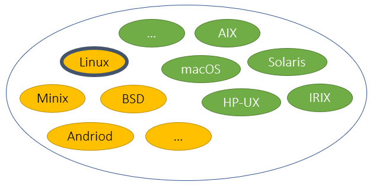
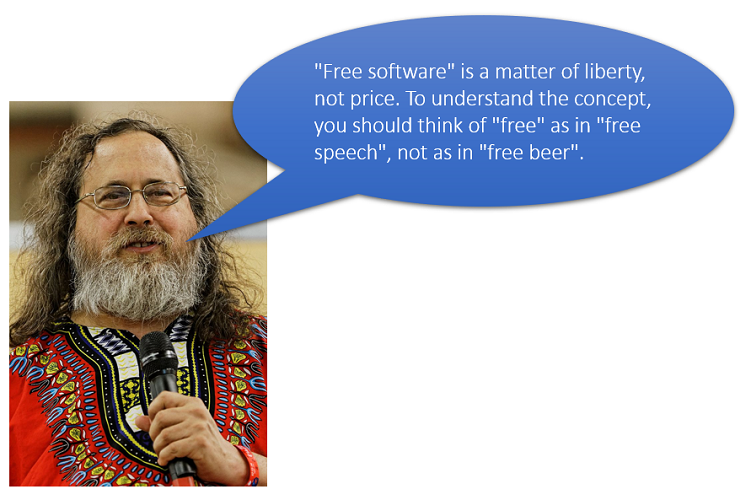
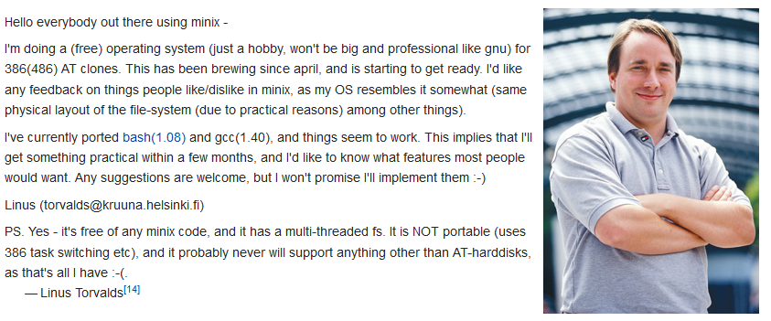
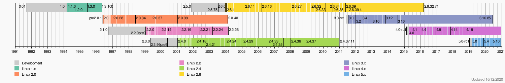
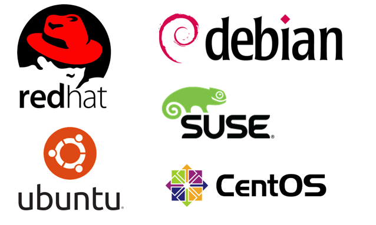
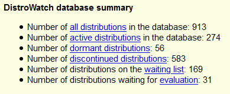
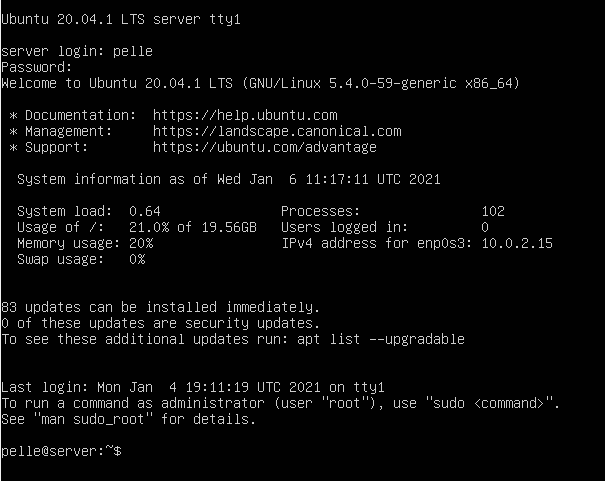
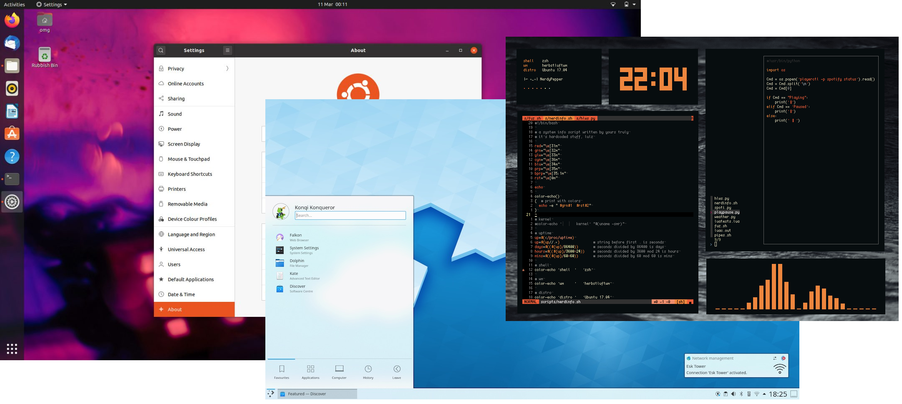

# linux-00

---

# POSIX

--

**P**ortable **O**perating **S**ystem **I**nterface for uni**X**

Definierar ett abstrakt operativsystem med alla dess grundläggande komponenter (**IEEE 1003.1**)

--

---

# GNU-projektet

--

Är ett Unixliknande operativsystem

Består enbart av fri mjukvara

Richard Stallman, 1983

Free Software Foundation, FSF

GNU = GNU's Not Unix!

GNU GPL (General Puplic License)

Det som saknades länge dock var kärnan i OS:et (Idag finns den och den heter Hurd)

--

## Fri mjukvara

--

## De fyra friheterna

--

**Frihet 0**: Friheten att använda programmet för vilket syfte som helst.

--

**Frihet 1**: Friheten att studera och modifiera programmet.

--

**Frihet 2**: Friheten att kopiera programmet så att du kan hjälpa din granne.

--

**Frihet 3**: Friheten att förbättra programmet och sedan offentliggöra dessa förbättringar så att de kommer allmänheten till del.

--

**FOSS** = Free and Open Source Software

---

# Linux

--

Skapades av Lins Torvalds

1991-08-25

--

--

[https://www.kernel.org/](https://www.kernel.org/)

---

# Distributioner

--

Linuxdistributörerna plockar ihop en samling program och bygger ett komplett operativsystem (med användarapplikationer) och distribuerar detta i ett lättinstallerat (nåja) paket.

--

--

[https://distrowatch.com/](https://distrowatch.com/)

---

# Utseende

--

## Skal

--

## Skrivbord

---

# SLUT!
