# linux-05

---

# Filsystemet

---

# Hemkatalog

--

Alla användare i systemet har en egen hemkatalog.

Återfinns i **/home**,t.ex **/home/pelle**

Det är här vi hamnar när vi loggar in.

Förkortas **~**

Din användare äger allt i katalogen.

---

# Absoluta- och relativa sökvägar

--

**Absolut sökväg** = utgår från rooten, t.ex `cd /home/pelle`

--

**Relativ sökväg** = utgår mappen man står i, t.ex `cd pelle`

---

# Navigera

--

`cd` = Change Directory

--

`cd /etc/apt/`

Förflyttar dig till katalogen **/etc/apt** oavsett var i filträdet du befinner dig.

--

`cd /`

Förflyttar dig till roten på filträdet oavsett var i filträdet du befinner dig.

`cd ~` eller `cd`

Förflyttar dig till din hemkatalog (t.ex **/home/pelle**) oavsett var i filträdet du befinner dig.

--

`cd ..`

Förflyttar dig ett steg bakåt/uppåt i filträdet, t.ex från **/home/pelle** till **/home/**

--

`cd ../..`

Förflyttar dig ett steg bakåt/uppåt i filträdet, t.ex från **/home/pelle** till **/**

--

`cd musik`

Förflyttar dig in i katalogen **musik**, som återfinns i katalogen där du befinner dig.

---

# Lista

--

`ls` = List ("ell-ess")

--

## Enkel listning

`ls`

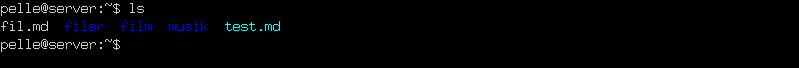

Vit = fil, blå = katalog, turkos = mjuk länk

--

## Lista i långt format

`ls -l`

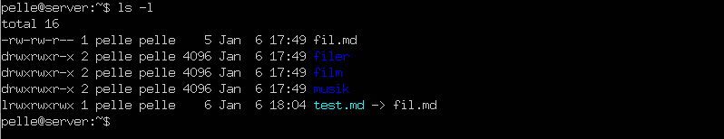

--

## Lista dolda filer/kataloger

`ls -a`

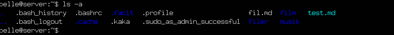

`ls -A`

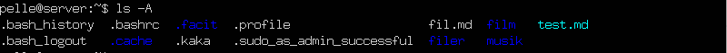

--

# Kombinera

`ls -Al`

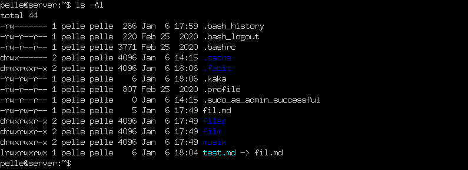

---

# Se vart man är

--

`pwd`

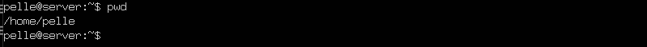

---

# Se innehållet i en fil

--

`cat` = concatenate files and print on the standardoutput

--

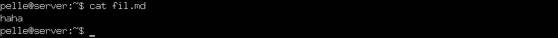

--

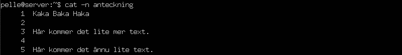

---

## Långt innehåll

--

`more`

**Enter** = hoppa fram en rad.

**Mellanslag** = hoppa fram en sida

--

`ls /etc | more` eller t.ex `more dump`

--

`less`

Med `less` kan duanvända upp/ned-pil för att förflytta dig i utdatat.

---

# Skapa filer

--

`touch`

--

`touch kaka` = Skapar en tom fil med namnet kaka

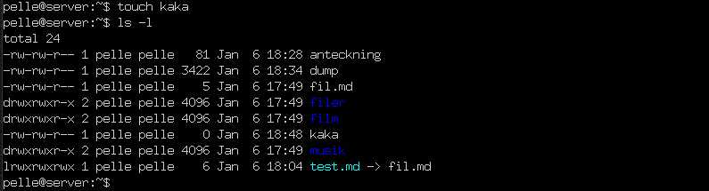

--

`touch anka1 anka2 anka3` = Skapar tre tomma filer

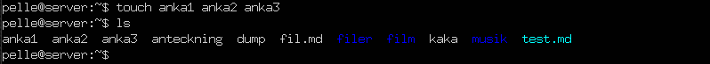

--

`touch --date="2020-12-24 15:00:00" anka1`

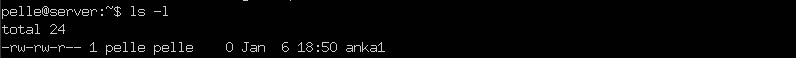

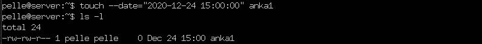

--

`cat >`, avsluta med `CTRL + D`

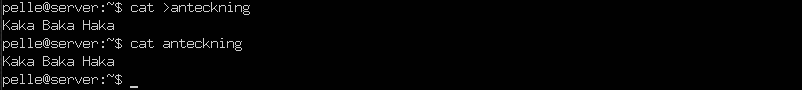

---

# Information om en fil

--

`stat` = Display file or file system status

--

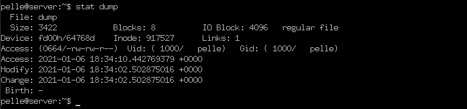

Här kan vi bland annat se när filen senast öppnades eller modifierades.

---

# Skapa kataloger

--

Doh!

---

# Ta bort filer

--

Doh!

---

# Ta bort kataloger

--

Doh!

---

# Kopiera

--

Doh!

---

## Filer

--

Doh!

---

## Kataloger

--

Doh!

---

# Döpa om filer/kataloger

--

Doh!

---

# Länkar

--

Doh!

--

## Mjuka länkar

Doh!

--

## Hårda länkar

stat:a

---

# Allting är filer (eller processer)

--

Doh!

---

# Visa monterade lagringsenheter

--

Doh!

---

# Slut!