# linux-05

---

# Filsystemet

---

# Hemkatalog

--

Alla användare i systemet har en egen hemkatalog.

Återfinns i **/home**, t.ex **/home/pelle**

Det är här vi hamnar när vi loggar in.

Förkortas **~**

Din användare äger allt i katalogen.

---

# Absoluta- och relativa sökvägar

--

**Absolut sökväg** = utgår från rooten, t.ex `cd /home/pelle`

--

**Relativ sökväg** = utgår mappen man står i, t.ex `cd pelle`

---

# Navigera

--

`cd` = Change Directory

--

```
cd /etc/apt/
```
Förflyttar dig till katalogen **/etc/apt** oavsett var i filträdet du befinner dig.

--

```
cd /
```

Förflyttar dig till roten på filträdet oavsett var i filträdet du befinner dig.

--

```
cd ~
cd
```

Förflyttar dig till din hemkatalog (t.ex **/home/pelle**) oavsett var i filträdet du befinner dig.

--

```
cd ..
```

Förflyttar dig ett steg bakåt/uppåt i filträdet, t.ex från **/home/pelle** till **/home/**

--

```
cd ../..
```

Förflyttar dig ett steg bakåt/uppåt i filträdet, t.ex från **/home/pelle** till **/**

--

```
cd musik
```

Förflyttar dig in i katalogen **musik**, som återfinns i katalogen där du befinner dig.

---

# Lista

--

`ls` = list directory contents ("ell-ess")

--

## Enkel listning

`ls`


Vit = fil, blå = katalog, turkos = mjuk länk

--

## Lista i långt format

```
ls -l
```


--

## Lista dolda filer/kataloger

```
ls -a
```


```
ls -A
```


--

## Kombinera flera växlar

```
ls -Al
```


--

## Lista annan plats

```
ls ~/start
```

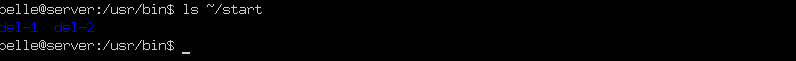

---

# Se vart man är

--

`pwd` = print name of current/working directory


---

# Se innehållet i en fil

--

`cat` = concatenate files and print on the standardoutput

--


--


---

## Långt innehåll

--

Ibland får inte innehållet plats på skärmen och då vi inte kan skrolla så kommer vi inte att kunna se all information. Det här kan vi lösa mha kommandona `more` eller `less`.

--

`more`

**Enter** = hoppa fram en rad.

**Mellanslag** = hoppa fram en sida

--

```
ls /etc | more
more dump
```

--

`less`

Med `less` kan duanvända upp/ned-pil för att förflytta dig i utdatat.

---

# Skapa filer

--

`touch` = change file timestamps

--

```
touch kaka
```

Skapar en tom fil med namnet kaka


--

```
touch anka1 anka2 anka3
```

Skapar tre tomma filer


--

`touch --date="2020-12-24 15:00:00" anka1`


--

`cat >`, avsluta med `CTRL + D`


---

# Information om en fil

--

`stat` = Display file or file system status

--


Här kan vi bland annat se när filen senast öppnades eller modifierades.

---

# Skapa kataloger

--

`mkdir` = make directories

--

```
mkdir test
```

Skapar en katalog där du befinner dig.

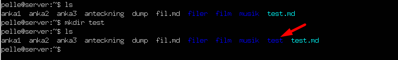

--

```
mkdir ~/test
```

Skapar en katalog i din hemkatalog oavsett var du befinner dig.

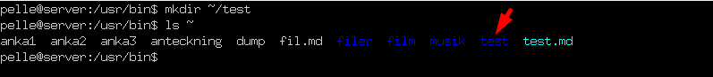

--

```html
mkdir -p start/del-1
mkdir -p start/del-2
```

Skapar katalogen start(om den inte finns) för att sedan skapa katalogen del-1 i den.

Skapar del-2 i mappen start (som vi skapade på raden innan).

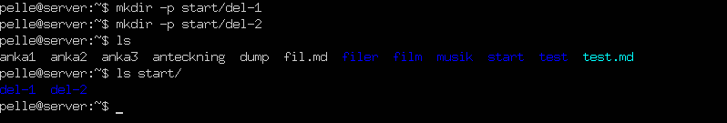

---

# Ta bort filer

--

`rm` = remove files or directories

--

```
rm kaka
```

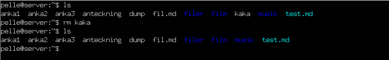

--

```
rm *.txt
```

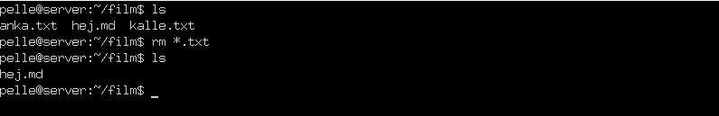

---

# Ta bort kataloger

--

`rmdir` = remove empty directories

--

```
rmdir musik
```

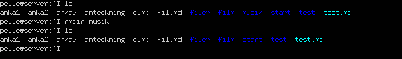

--

```
rmdir filer
```

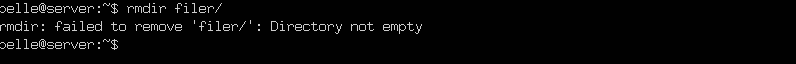

---

# Kopiera filer/kataloger

--

`cp` = copy files and directories

--

```
cp fil.md fil2.md
```

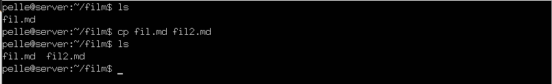

--

```
cp /etc/rsyslog.conf .
```

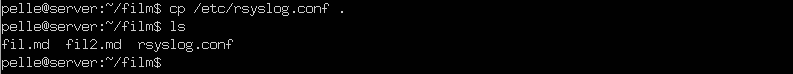

--

```
cp -r ../filer .
```

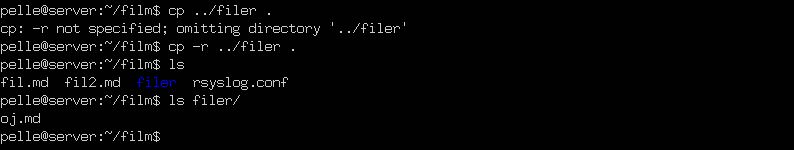

--

```html
cp -r filer/ backup
```

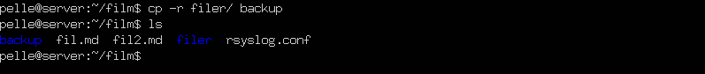

---

# Flytta filer/kataloger

--

`mv` = move (rename) files

--

## Filer

```
mv fil.md filer/
```


--

## Kataloger

```
mv backup/ filer/
```

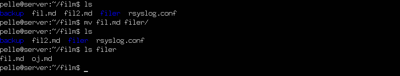

--

# Döpa om filer/kataloger

`mv` = move (rename) files

--

```
mv fil2.md haha.md
```

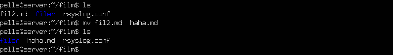

---

# Länkar

--

`ln` = make links between files

--

## Mjuka länkar

--

Fungerar (nästan) som genvägarna i Microsoft Windows.

Tar man bort genvägen finns originalfilen kvar.

Tar man bort originalfilen så finns genvägen kvar, men den pekar till något som inte finns.

--

```
ln -s orginalet linken
```

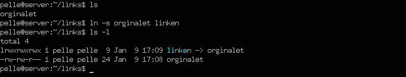

--

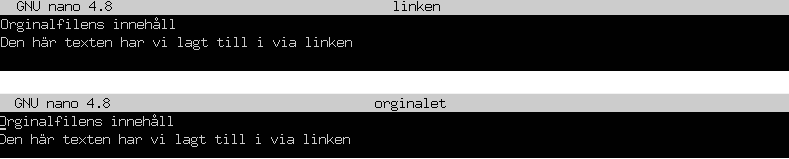

Vi öppnar nu länken (linken) i nano och skriver in lite text för att sedan avsluta nano (givetvis sparar vi).

Om vi nu öppnar originalet ser vi att ändringen finns kvar.

**Kom ihåg!** Mjuka länkar kan ses som genvägar i Microsoft Windows.

--

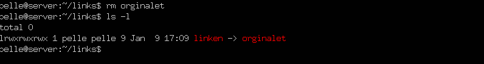

Här har vi raderat originalet och då ser vi att vår länk blir röd = trasig

--

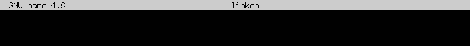

Öppnar vi länken (linken) i nano så ser vi att det är tomt.

--

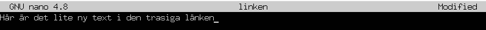

Vi passar på att skriva in lite innehåll… och spar ändringarna.

--

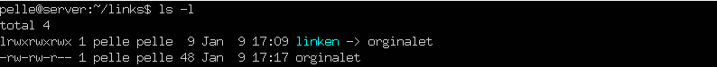

Aha! Nu skapas originalet igen

--

## Hårda länkar

--

Hårda länkar är pekare till en fil.

Flera hårda länkar kan peka på samma fil.

Filen försvinner först efter att alla hårda länkar har raderats.

Om du raderar originalfilen men inte de hårda länkarna finns de hårda länkarna kvar, liksom fildatan.

--

```
ln orginalet link
```

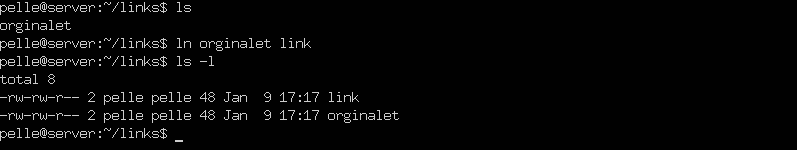

--

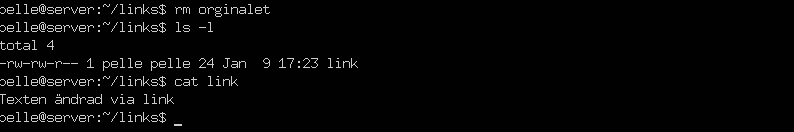

Tar vi bort originalet så kommer länken fortfarande att fungera.

--

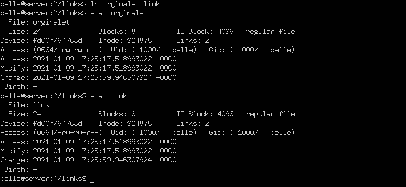

---

# Jokertecken

--

* = Okänt antal tecken

- *.txt = Alla txt-filer
- f*.txt = Alla txt-filer som börjar på f
- i*.* = Alla filer som börjar på i

--

? = Ett okänt tecken

- ?.txt = Alla txt-filer som har ett tecken i filnamnet
- f??.txt = Alla txt-filer som börjar på f och har två tecken därefter
- f*.p? = Alla filer som börjar på f och vars filändelse börjar på p och följs av ett tecken

--

[] = Område

- [bf]*.txt = Alla txt-filer som börjar på b eller f
- *[2-4].html = Alla html-filer som slutar på 2, 3 eller 4.

---

# Allting är filer (eller processer)

--

Doh!

---

# Visa monterade lagringsenheter

--

Doh!

---

# Filmer

--

**TIF275 Datorintroduktion, Chalmers**
[Linux 1: Grunderna](https://www.youtube.com/watch?v=yzeY5H-8nVk)
[Linux: Knep i terminalen](https://www.youtube.com/watch?v=V-tLqN5yp90)

--

**dbwebb - Blekinge Tekniska Högskola**
[02 cat](https://www.youtube.com/watch?v=a2P26Zgy_mE)

--

**Linux Commands for Beginners**
- [Navigating the Filesystem](https://www.youtube.com/watch?v=MnY0K-3_Fjk)
- [Moving and Renaming Files](https://www.youtube.com/watch?v=cSBYvSA9rDM)

--

**HakTip - Linux Terminal 101**
- [Getting Started](https://www.youtube.com/watch?v=b5NmtmNwMgU)
- [File Manipulation](https://www.youtube.com/watch?v=e13o3DcjT6Y)
- [Using CAT with Standard Inputs](https://www.youtube.com/watch?v=SfuEdUiEFtw)

---

# Slut!